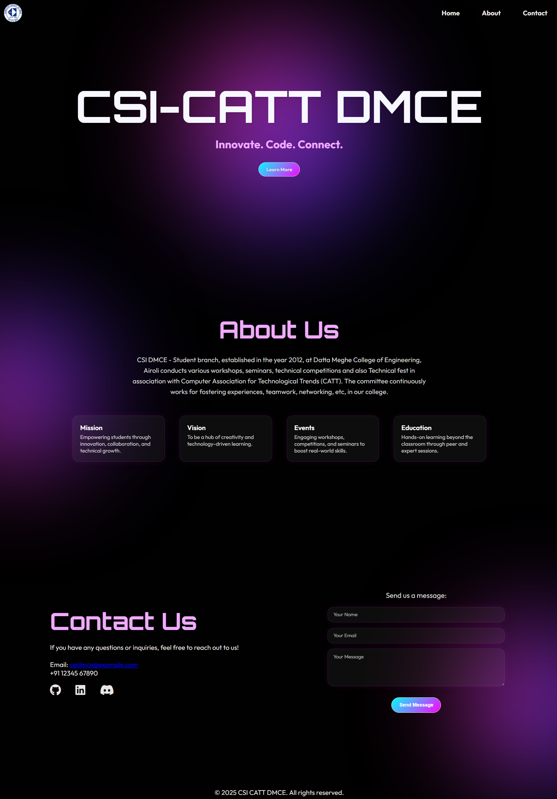

# CSI DMCE landing page

A sleek, futuristic landing page built for CSI-CATT DMCE website.

## Features:
- Modern/Minimalist aesthetic
- Glassmorphism-esque info cards
- Smoothscrolling sections
- Contact form layout

## Preview:

Note: Currently optimized for **desktop view** only. 

## Link:

Deployed at Github Pages: 

## Purpose:

Made as a part of the CSI Club technical task. 
The goal: to design a visually impressive landing page aligned with CSI's futuristic and tech-driven vision.
